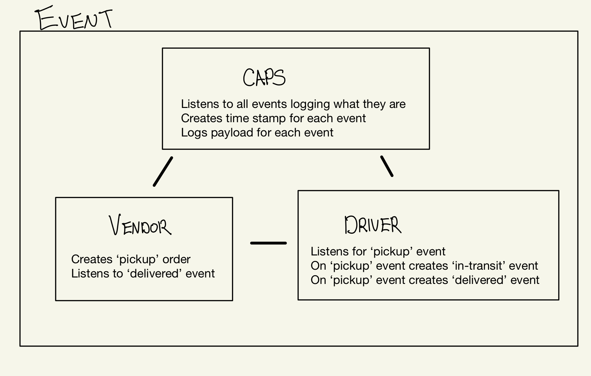

# LAB - Class xx

## Project: Event Driven Application

### Author: Ellis Yoo

### Links and Resources
<!-- 
- [ci/cd](http://xyz.com) (GitHub Actions)
- [back-end server url](http://xyz.com) (when applicable)
- [front-end application](http://xyz.com) (when applicable) -->
N/A
### Setup
Packages needed for this application is 
- `faker`
- `socket.io`
- `socket.io-client`

#### `.env` requirements (when applicable)
<!-- i.e.

- `PORT` - Port Number
- `MONGODB_URI` - URL to the running mongo instance/db -->

#### How to initialize/run your application (where applicable)

- In order to start the application run `node caps.js` on the terminal to start the server side
- run `node vendor.js` and `node driver.js` on seperate terminals

#### Tests
<!-- 
- How do you run tests?
- Any tests of note?
- Describe any tests that you did not complete, skipped, etc -->
- N/A
#### UML / Application Wiring Diagram

